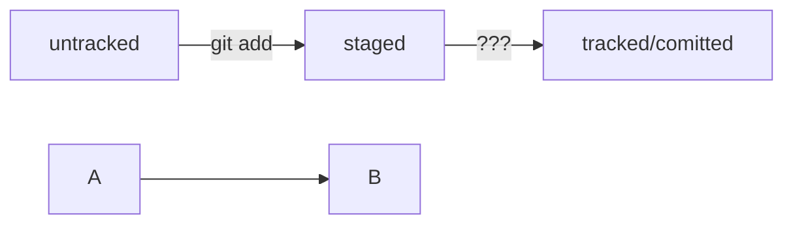

# Шпаргалка по работе с коммандной строкой а так же с Git и GitHub!
## 1. Работа с коммандной строкой
  + __pwd__ (от англ. print working directory — «показать рабочую папку»).<br> __Выводит путь к текущей директории__
```BASH
$ pwd
/c/Users/%USERNAME%
```
  + __cd__ (от англ. change directory — «сменить директорию»)<br> __Меняет директорию__
```BASH
/projects
    /github
                /open-source-project
    /practicum
                /my-project 
```
```BASH
$ pwd
/projects # сейчас мы здесь

$ cd github # переходим в папку github

$ pwd
/projects/github # теперь мы здесь!  
```
__.__ Текущая директория <br>
__..__ Директория выше <br>
__~__ Домашняя директория
__ls__ (от англ. list directory contents — «отобразить содержимое директории»).<br>
__-a__ флаг для отображения скрытых файлов и папок
+  __touch__ (англ. «коснуться») с именем файла в качестве параметра: __touch %ИМЯ_ФАЙЛА%__ <br>  __Создает новый файл__
```BASH
$ touch my-new-file.txt # создали файл my-new-file.txt 
```
+ __mkdir__ (от англ. make directory — «создать директорию»). <br> __Создает новую директорию__
```BASH
$ mkdir new-dir # создали директорию new-dir 
```
с флагом -p можно создать целую структуру директорий
```BASH
$ mkdir -p dir1/dir-inside/dir-deeper-inside
# создали папку dir-deeper-inside в папке dir-inside, которая находится в папке dir1 
```
+  __cp__ (от англ. copy — «копировать»). В простом виде cp принимает два параметра: что копируем и куда копируем. <br>
Копирование файлов
```BASH
$ cp index.html src/
# скопировали index.html в папку src 
```
```BASH
$ cp index.html style.css script.js src/
# скопировали три файла (index.html, style.css и script.js) в папку src 
```
+ __mv__ (от англ. move — «переместить»). <br> __Перемещение файлов или папок__
```BASH
$ mv table.csv ./very-important-files
# сначала указываем имя файла, который хотим переместить, потом путь — куда перемещаем 
```
+ __cat__ (от англ. concatenate and print — «объединить и распечатать») <br> __Чтение текстовых файлов_
```BASH
$ cat myfile.txt # распечатали содержимое файла myfile.txt
file-content-1
file-content-2 
```
+ __rm__ (от англ. remove — «удалить»)<br> __Удалить файл__
```BASH
$ rm example.txt # удалили файл example.txt из текущей папки 
```
+ __rmdir__ (от англ. remove directory — «удалить директорию»)<br>
__Удалить пустую директорию__
```BASH
$ rmdir images # команда удалит папку images из текущей директории, 
               # если папка images пуста
```
Если папку всё-таки нужно удалить вместе со всем её содержимым, можно использовать команду __rm__ так:
```BASH
$ rm -r images # удалили папку images со всем её содержимым из текущей директории 
```
__-r__ — (от англ. recursive, «рекурсивный») рекурсивно удаляет файлы и папки. Это значит, что удаление будет последовательно применяться к каждому из элементов в этой папке — пока не сотрёт их все. Затем команда удалит пустую директорию.
## 2. Работа с Git
   1. ### файл __.gitconfig__
  ```BASH
  $ git config --global user.name "User Namovich" 
  # имя или ник нужно написать латиницей и в кавычках

  $ git config --global user.email username@yandex.ru
  # здесь нужно указать свой настоящий email 
  ```
__user,name__  - Имя или никнейм <br>
__user.email__ - Электронная почта <br>
Вывести содержимое файла конфигурации Git
```BASH
$ git config --list
```
  2. ### Инициализация репозитория
__git init__ (от англ. initialize — «инициализировать»)<br>
Инициализирует для текущей папку Git-репозиторий
```BASH
$ cd ~/dev/first-project # перешли в нужную папку

$ git init # создали репозиторий 
```
что бы "разгитить" папку, нужно удалить скрытую подпапку __.git__
```BASH
$ cd <папка с репозиторием> # перешли в папку

$ rm -rf .git # удалили подпапку .git 
```
__-f__ (от англ. force — «заставить») избавит вас от вопросов вроде «Вы точно хотите удалить этот файл? А этот? И этот тоже?»<br>

  3. ### Проверить состояние репозитория
__git status__ (от англ. status — «статус», «состояние»)<br>__Показывает текущее состояние репозитория__<br>
Команда __git status__ выведет:<br>

__On branch master__ или __On branch main__ - название текущей ветки<br>

__No commits yet__ - сообщение о том, что в репозитории ещё нет коммитов<br>

__nothing to commit (create/copy files and use "git add" to track)__ - сообщение, которое говорит: «чтобы что-нибудь закоммитить (то есть зафиксировать), нужно сначала это создать»<br>

__untracked__ значит, что Git ещё не хранит информацию о версиях файла и не может отследить, как он изменялся.

  3. ### Подготовить файлы к сохранению
  __git add__ - (от англ. add — «добавить») - подготовить файл к сохранению в репозиторий
  флаг __--all__ (от англ. all — «всё») добавляет все файлы из директории
  ```BASH
  $ git add --all # подготовили к сохранению все файлы в репозитории
  ```
```BASH
$ git add todo.txt
$ git add readme.txt
```
В __git status__ Файлы, которые отмечены зелёным, теперь отслеживаются и готовы к сохранению.<br>

Если сейчас отредактировать любой из «зелёных» файлов он перейдёт в состояние __modified__ (англ. «изменённый») и будет и в «зелёном», и в «красном» списках. 

  4. ### Коммит
__git commit__ c ключом __-m__ (от англ. message — «сообщение»)<br>
__Присваивает коммиту сообщение__
```BASH
$ git commit -m ‘Мой первый коммит!’ 
```
Команда __git commit__ выведет информацию о коммите:<br>

  + __[master (root-commit) baa3b6e]__ - значит:
коммит был в ветке master<br>

  + __root-commit__ - это самый первый, или «корневой» (англ. root), коммит в ветке, у следующих коммитов такой надписи не будет<br>

  + __baa3b6e__ - сокращённый идентификатор коммита<br>

  + __2 files changed, 1 insertion(+)__ - значит:
изменились два файла; одна строка была добавлена<br>
  + __create mode 100644__ - create (англ. «создать») говорит, что файл был создан. Если бы файл был удалён, на этом месте было бы слово delete (англ. «удалить»)<br>
 + __mode 100644__ - сообщает, что это обычный файл. Также возможны варианты 100755<br>

  5. ### Просмотреть историю коммитов
 __git log__ (от англ. log — «журнал [записей]»)<br>
 __Показать лог коммитов__

## 3. Работа с GitHub
   ### 1. Создание удалённого репозитория
   1. Зайти в свой профиль по ссылке https://github.com/username, где username — имя, которое вы указали при регистрации.<br>

   2. Создать репозиторий. Для этого перейдите на вкладку __Repositories__ (англ. «репозитории»), а затем нажмите на зелёную кнопку __New__ (англ. «новый») справа.<br>

   3. В окне создания нового репозитория ввести имя
  ### 2. Генерируем SSH-ключ
  Проверка наличия SSH-ключа
  ```BASH
  $ cd ~ # перешли в домашнюю директорию 
  $ ls -la .ssh/ # вывели список созданных ключей 
  ```
  1. Для генерации SSH-пары можно использовать программу ssh-keygen. Открыть терминал и введите следующую команду
  ```BASH
  $ ssh-keygen -t ed25519 -C "электронная почта, к которой привязан ваш аккаунт на GitHub" 
  ```
  Если вы видите сообщение об ошибке, то, скорее всего, система не поддерживает алгоритм шифрования ed25519. Ничего страшного: используйте другой алгоритм.
```BASH
$ ssh-keygen -t rsa -b 4096 -C "электронная почта, к которой привязан ваш аккаунт на GitHub"
```
После ввода отобразится такое сообщение.
```BASH
> Generating public/private rsa key pair. # сгенерированы публичный и приватный ключи
```
2. Указать место хранения ключей. Простой вариант — сделать домашний каталог пользователя путём по умолчанию. Для этого нажать Enter
```BASH
> Enter a file in which to save the key (C:\Users\<имя_пользователя>\.ssh\):[Press enter] 
```
Теперь в указанной директории появится пара ключей.
3. Программа запросит кодовую фразу (англ. passphrase) для доступа к SSH-ключу. Можно оставить поле пустым. Для этого нажать Enter, а затем ещё раз Enter для подтверждения
```BASH
> Enter passphrase (empty for no passphrase): [Type a passphrase]
> Enter same passphrase again: [Type passphrase again]
```
4. Готово! Теперь осталось проверить, что ключи действительно сгенерировались.
```BASH
ls -a ~/.ssh 
```
 На экране должны появиться два файла — один с расширением .pub, другой — без. Файл в .pub — публичный, им можно делиться с веб-сайтами или коллегами. Файл без расширения .pub — приватный. Ни в коем случае не передавать его никому! 

### 3. Привязываем SSH-ключ к GitHub
1. Скопировать содержимое ключа в буфер обмена
```BASH
# для rsa:
$ clip < ~/.ssh/id_rsa.pub
# для ed25519:
$ clip < ~/.ssh/id_ed25519.pub
```
2. Перейти на __GitHub__ и выберите пункт __Settings__ (англ. «настройки») в меню аккаунта.<br>

3. В меню слева нажмите на пункт SSH and GPG keys.<br>

4. В открывшейся вкладке выберите __New SSH key__ (англ. «новый SSH-ключ»).<br>

5. В поле __Title__ (англ. «заголовок») напишите название ключа. Например, Personal key (англ. «личный ключ»).<br>

6. В поле __Key type__ (англ. «тип ключа») должно быть __Authentication Key__ (англ. «ключ аутентификации»).<br>

7. В поле __Key__ скопируйте ваш ключ из буфера обмена.<br>

8. Нажать на кнопку __Add SSH key__ (англ. «добавить SSH-ключ»).<br>
9. Проверьте правильность ключа с помощью следующей команды
```BASH
$ ssh -T git@github.com 
```
Если это первый раз, когда вы используете Git, чтобы поделиться проектом на GitHub, появится похожее предупреждение.
```BASH
The authenticity of host 'github.com (140.82.121.4)' can't be established. ED25519 key fingerprint is SHA256:+DiY3wvvV6TuJJhbpZisF/zLDA0zPMSvHdkr4UvCOqU. This key is not known by any other names. Are you sure you want to continue connecting (yes/no/[fingerprint])?
```
Это предупреждение сообщает, что вы никогда не соединялись с сервером GitHub. Поэтому Git не может гарантировать, что сервер является тем, за кого он себя выдаёт.<br>
Для подтверждения подлинности сервер генерирует и публикует ключи SHA256. Можно проверить ключи GitHub по этой [ссылке](https://docs.github.com/en/authentication/keeping-your-account-and-data-secure/githubs-ssh-key-fingerprints). Если ключ в предупреждении совпадает с тем, что на сайте, значит, сервер является действительным. Ввести __yes__, чтобы продолжить.
```BASH
Hi %ВАШ_АККАУНТ%! You've successfully authenticated, but GitHub does not provide shell access.
```
10. Создание агента
```BASH
$ eval "$(ssh-agent -s)"
```
или
```BASH
$ eval (ssh-agent -c)
> Agent pid номер
```
11. Добавить агенту приватный ключ
```BASH
$ ssh-add -K ~/.ssh/id_ed25519
> Identity added (адресс ключа)
```
### 4. Связываем локальный и удалённый репозитории
1. Перейти на страницу удалённого репозитория, выбрать тип SSH и скопировать URL<br>

2. __git remote add__ (от англ. remote — «удалённый» и add — «добавить»). 
```BASH
$ cd ~/dev/first-project
$ git remote add origin git@github.com:%ИМЯ_АККАУНТА%/first-project.git 
```
Команде необходимо передать два параметра: имя удалённого репозитория и его URL. В качестве имени используйте слово __origin__. А URL скопирован со страницы удалённого репозитория.<br>
__origin__ (англ. «источник») — стандартный псевдоним, с помощью которого можно обращаться к главному удалённому репозиторию (обычно такой репозиторий один). Это значительно упрощает работу.<br>

3. Убедиться, что репозитории связаны
```BASH
$ git remote -v
origin    git@github.com:%ИМЯ_АККАУНТА%/%ИМЯ-ПРОЕКТА%.git (fetch)
origin    git@github.com:%ИМЯ_АККАУНТА%/%ИМЯ-ПРОЕКТА%.git (push)
```
В выводе должны быть две строчки, аналогичные тем, что показаны выше.
Флаг -v — короткая форма флага --verbose (англ. «подробный»). Он позволяет показать больше информации в выводе.

### 4. Синхронизируем локальный и удалённый репозитории
__git push__ (от англ. push — «толкать»)<br> __Отправить изменения на удалённый репозиторий__<br>

В первый раз эту команду нужно вызвать с флагом __-u__ и параметрами __origin__ (имя удалённого репозитория) и __main__ или __master__ (название текущей ветки). Флаг __-u__ свяжет локальную ветку с одноимённой удалённой.
```BASH
$ git push -u origin main # Если команда приведёт к ошибке,     попробуйте заменить main на master.
```
При взаимодействии с удалёнными репозиториями Git выводит в консоль отладочную информацию: количество объектов (файлов), которые отправляются на сервер, информацию о прогрессе сжатия и записи и так далее.<br>

В дальнейшем при работе с удалённым репозиторием флаг -u можно опустить и писать просто git push.

### 5. Файл README.md
Чтобы другие пользователи, а также потенциальные клиенты или работодатели могли понять, что представляет собой проект, его нужно описать. Такое описание принято указывать в файле __README.md__ (от англ. read — «прочитай» и me — «меня»)<br>

Как правило, в README.md проекта можно найти следующую информацию:
1. Название проекта и его краткое описание: кем создан, для чего, какие решает задачи и какие закрывает проблемы.<br>

2. Технологии, которые применяются в проекте. В чём его отличие от аналогичных.<br>

3. Документация проекта — подробная инструкция о том, что представляет собой проект.<br>

4. Планы проекта, если они есть.<br>

#### Создание и оформление README.md
1. ### Заголовки, абзацы и перенос
  + Заголовки разных уровней создают решётками.

```MARKDOWN
# H1 — заголовок первого уровня, самый большой
## H2 — заголовок второго уровня, поменьше
### H3
#### H4
##### H5
###### H6 — заголовок шестого уровня, самый маленький
```

  + Можно добавить черту под заголовком или абзацем.
```MARKDOWN
#### Заголовок 4

Текст над чертой

---

Текст под чертой
```
  + Чтобы сделать разрыв строки, нужно поставить два пробела (в примере ниже они обозначены точками ⋅⋅) или сочетание символов \<br>.
```MARKDOWN
Текст до переноса⋅⋅  
Текст после переноса <br>
Текст после второго переноса
```
  + Чтобы начать новый параграф, в конце предыдущей строки должно стоять два символа переноса. Для этого нужно нажать Enter два раза.

```MARKDOWN
line

another line 
```
2. ### Выделение текста
  + Чтобы выделить текст курсивом (\*текст*), его заключают в звёздочки (астериски) или нижние подчёркивания.
```MARKDOWN
Курсив — это *звёздочки* или _подчёркивания_.
```
  + Чтобы выделить текст полужирным шрифтом (\*\*текст**), его окружают двойными звёздочками или двойными нижними подчёркиваниями.
```MARKDOWN
Полужирный шрифт — двойные **звёздочки** или двойные __подчёркивания__.
Можно совместить выделение **звёздочки и _подчёркивания_**.
```
  + Чтобы зачеркнуть текст (\~\~текст~~), его окружают двойными волнистыми линиями — тильдами.
```MARKDOWN
~~Зачёркнутый текст.~~
```
3. ### Списки
  + Для оформления нумерованного списка достаточно поставить в начало строки цифры с точкой.
```MARKDOWN
1. Первый пункт нумерованного списка.
2. Второй пункт.
```
  + Ненумерованный список создаётся звёздочкой с пробелом в начале строки либо дефисом с пробелом.
```MARKDOWN
* первый пункт ненумерованного списка;
* второй пункт ненумерованного списка

- первый пункт ненумерованного списка;
- второй пункт ненумерованного списка
```

4. ### Ссылки
  + Чтобы сделать ссылкой часть текста, его заключают в квадратные скобки, а затем указывают нужный адрес в круглых скобках.
```MARKDOWN
[Яндекс](https://www.yandex.ru)
```
  + Также можно добавить ссылке тайтл (от англ title — «название», «заголовок»). Тайтл — это всплывающая подсказка, которая появляется при наведении мыши на ссылку. Тайтл нужно заключить в кавычки и указать внутри скобок после адреса.
```MARKDOWN
[Яндекс](https://www.yandex.ru "Я Yandex!")
```

5. ### Код
  + Чтобы оформить текст как код, нужно окружить его тройками косых кавычек — грависов. После первой тройки грависов указывают язык программирования, на котором написан код. В маркдауне есть поддержка синтаксиса почти всех популярных языков и инструментов.<br>

```html
<h1>А я просто текст</h1>
```
```bash
ls - la
```

[Дополнительная шпаргалка по Markdown](https://gist.github.com/fomvasss/8dd8cd7f88c67a4e3727f9d39224a84c)<br>

## 4. Статусы файлов
### 1. Хеш — идентификатор коммита
Хеширование (от англ. hash, «рубить», «крошить», «мешанина») — это способ преобразовать набор данных и получить их «отпечаток» (англ. fingerprint).<br>

Git хеширует (преобразует) информацию о коммите с помощью алгоритма SHA-1 (от англ. Secure Hash Algorithm — «безопасный алгоритм хеширования») и получает для каждого коммита свой уникальный хеш — результат хеширования.<br>

Обычно хеш — это короткая (4040 символов в случае SHA-1) строка, которая состоит из цифр 0—90—9 и латинских букв A—FA—F (неважно, заглавных или строчных). Она обладает следующими важными свойствами:
  + если хеш получить дважды для одного и того же набора входных данных, то результат будет гарантированно одинаковый;
  + если хоть что-то в исходных данных поменяется (хотя бы один символ), то хеш тоже изменится (причём сильно).

Git хранит таблицу соответствий хеш → информация о коммите. Если вы знаете хеш, вы можете узнать всё остальное: автора и дату коммита и содержимое закоммиченных файлов. Можно сказать, что хеш — основной идентификатор коммита.<br>

Все хеши и таблицу хеш → информация о коммите Git сохраняет в служебные файлы. Они находятся в скрытой папке .git в репозитории проекта.<br>

### 2. Исследуем лог
__git log__ - Вызывает  список коммитов<br>

Элементы, из которых состоит описание:
  + строка из цифр и латинских букв после слова commit — это хеш коммита
  + Author — имя автора и его электронная почта
  + Date — дата и время создания коммита
  + в конце находится сообщение коммита.
Вот так выглядит описание самого первого коммита в репозитории Git.
```commandline
commit e83c5163316f89bfbde7d9ab23ca2e25604af290
Author: Linus Torvalds <torvalds@linux-foundation.org>
Date:   Thu Apr 7 15:13:13 2005 -0700

    Initial revision of "git", the information manager from hell 
```
__git log --oneline__ - Сокращенный лог<br>
В терминале появятся только первые несколько символов хеша каждого коммита и их комментарии.<br>
Сокращённый хеш (то есть первые несколько символов полного) можно использовать точно так же, как и полный. 
Для этого команда git log --oneline автоматически подбирает такую длину сокращённых хешей, чтобы они были 
уникальными в пределах репозитория и Git всегда мог понять, о каком коммите идёт речь.<br>
Что бы выйти из режима просмотра лога нажать __Q__

### 3. HEAD — всему голова
Файл HEAD (англ. «голова», «головной») — один из служебных файлов папки .git. Он указывает на коммит, 
который сделан последним (то есть на самый новый)<br>
```BASH
$ pwd # посмотрели, где мы
/Users/user/dev/first-project

$ cd .git/
$ ls # посмотрели, какие есть файлы
COMMIT_EDITMSG  ORIG_HEAD  description  index  logs/     refs/
HEAD            config     hooks/       info/  objects/

$ cat HEAD # команда cat показывает содержимое файла
ref: refs/heads/master # в файле вот такая ссылка
```
Внутри HEAD — ссылка на служебный файл: refs/heads/master (или refs/heads/main в зависимости от названия 
ветки). Если заглянуть в этот файл, можно увидеть хеш последнего коммита.<br>
```BASH
$ cat refs/heads/master # взяли ссылку из файла HEAD
# внутри хеш
e007f5035f113f9abca78fe2149c593959da5eb7

$ git log 
# сверяем с хешем последнего коммита
commit e007f5035f113f9abca78fe2149c593959da5eb7
Author: John Doe <johndoe@example.com>
Date:   Tue Mar 28 00:26:53 2023 +0300

    Добавить амбиций в список дел

... # другие коммиты
```
После коммита  Git обновляет refs/heads/master — записывает в него хеш последнего коммита.<br>

HEAD тоже обновляется, так как ссылается на refs/heads/master<br>

При работе с Git указатель HEAD используется довольно часто. Если нужно передать последний коммит, то 
вместо его хеша можно просто написать слово HEAD — Git поймёт, что вы имели в виду последний коммит.

### 4. Статусы файлов в Git
#### 1. Статусы untracked/tracked, staged и modified
 +  __untracked__ (англ. «неотслеживаемый»)
Новые файлы в Git-репозитории помечаются как untracked, то есть неотслеживаемые. Git «видит», что такой 
файл существует, но не следит за изменениями в нём. У __untracked__-файла нет предыдущих версий, 
зафиксированных в коммитах или через команду __git add__<br>


 + __staged__ (англ. «подготовленный»)
После выполнения команды git add файл попадает в __staging area__ (от англ. stage — «сцена», «этап 
[процесса]» и area — «область»), то есть в список файлов, которые войдут в коммит. В этот момент файл 
находится в состоянии __staged__<br>
__Staging area__ также называют __index__ (англ. «каталог») или cache (англ. «кеш»), а состояние файла 
staged иногда называют indexed или cached. Все три варианта могут встречаться в документации и в качестве 
флагов команд Git.<br>


 + __tracked__ (англ. «отслеживаемый»)
Состояние __tracked__ — это противоположность __untracked__. Оно довольно широкое по смыслу: в него попадают файлы, 
которые уже были зафиксированы с помощью __git commit__, а также файлы, которые были добавлены в __staging area__ 
командой __git add__. То есть все файлы, в которых Git так или иначе отслеживает изменения.<br>


 + modified (англ. «изменённый»)
Состояние __modified__ означает, что Git сравнил содержимое файла с последней сохранённой версией и нашёл 
отличия. Например, файл был закоммичен и после этого изменён.<br>

#### 2. Про staged и modified
Команда git add добавляет в staging area только текущее содержимое файла. Если сделаеть __git add file.txt__, 
а затем изменить __file.txt__, то новое содержимое файла не будет находиться в __staging__.<br>

Git сообщит об этом с помощью статуса __modified__: файл изменён относительно той версии, которая уже в 
staging. Чтобы добавить в staging последнюю версию, нужно выполнить git add file.txt ещё раз.

#### 3. Типичный жизненный цикл файла в Git


1. Файл только что создали. Git про него ещё ничего не знает. Состояние: untracked<br>


2. Файл добавили в staging area с помощью git add. Состояние: staged (+ tracked)<br>


  +  Возможно, изменили файл ещё раз. Состояния: staged, modified (+ tracked)<br>
Обратите внимание: staged и modified у одного файла, но у разных его версий.
  + Ещё раз выполнили git add. Состояние: staged (+ tracked)<br>


3. Сделали коммит с помощью git commit. Состояние: tracked.<br>


4. Изменили файл. Состояние: modified (+ tracked)<br>


5. Снова добавили в staging area с помощью git add. Состояния: staged (+ tracked)<br>


6. Сделали коммит. Состояния: tracked<br>


7. Повторили пункты 4-74−7 много-много раз.<br>

#### 4. Оформление сообщений к коммитам
То, как написаны сообщения коммитов, тоже может подчиняться определённым правилам. Иногда эти правила 
продиктованы культурой команды, а иногда техническими ограничениями.<br>

В выводе команды __git log --oneline__ умещается максимум 72 первых символа сообщения, поэтому многие 
правила включают пункт: «Сообщение не должно быть длиннее 72 символов»<br>

У каждого коммита в Git есть сообщение — то, что передаётся после параметра -m. 
Например: git commit -m "Добавить урок про оформление сообщений коммитов"<br>

Есть общие рекомендации по тому, как правильно составить сообщение. Оно должно быть:
+ относительно коротким, чтобы его было легко прочитать
+ информативным
Вот пример полезного сообщения в репозитории новостного сайта: Исправление опечатки в заголовке главной 
страницы на хорватском. Такое сообщение даёт много информации:
+ Исправление опечатки значит, что исправлена ошибка, которая была допущена при наборе. Такое исправление 
+ не меняет смысл. То есть, например, главному редактору не нужно перепроверять этот заголовок.
+ На хорватском говорит о том, что переводчикам на другие языки этот коммит можно смело пропускать.
+ В заголовке главной страницы указывает, где произошли изменения. Если, например, кто-то зайдёт на сайт 
и ему не понравится новый заголовок, он легко найдёт по истории (git log) автора этого коммита и 
спросит у него, почему заголовок теперь такой.

#### Стили оформления
Чтобы упростить работу, команды или даже целые компании часто договариваются об определённом стиле 
(то есть о правилах) оформления сообщений коммитов.
Например, правила могут быть такие:
+ длина сообщения от 30 до 72 символов
+ первое слово — глагол в инфинитиве («исправить», «дополнить», «добавить» и другие)
+ и так далее

В корпоративном стиле в начале сообщения обычно указывают Jira-ID, а после — текст сообщения.
```BASH
$ git commit -m "LGS-239: Дополнить список пасхалок новыми числами"
```
#### Conventional Commits
Стандарт Conventional Commits (англ. «соглашение о коммитах») отличается качественной документацией и 
подробной проработкой. Он подходит для репозиториев с исходным кодом программ.<br>


Conventional Commits предлагает такой формат коммита: <type>: <сообщение>. Первая часть type — это тип 
изменений. Таких типов достаточно много. Вот два примера:
+ feat (англ. «навык») — для новой функциональности
+ fix (от англ. «исправить», «устранить») — для исправленных ошибок
Например, сообщение может быть таким.
```BASH
+ git commit -m "feat: добавить подсчёт суммы заказов за неделю"
```
#### Инфинитив и императив
Для сообщений на русском языке часто рекомендуют использовать инфинитивы. Например: Добавить тесты для 
PipkaService, Исправить ошибку #123 и так далее.
Для сообщений на английском рекомендуется использовать повелительное наклонение (англ. imperative). 
Например: Use library mega_lib_300, Fix exit button и так далее.
Эти рекомендации сложились исторически, и им следуют многие проекты.